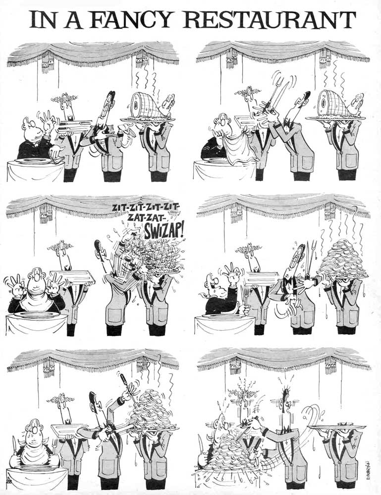

don_martin
==========

Makes Don Martin words, phrases, etc.  Whee.  (If you're not a Mad Magazine reader, don't bother.)


What?
-----

Don Martin is a cartoonist noted in part for extensive use of creative onomatopoeia.


```erlang
% individual random words

1> don_martin:word().
"doonk"

2> don_martin:word().
"kachoo"

3> don_martin:word().
"ting"

4> don_martin:word().
"gashplutzga"

5> don_martin:word().
"fween"


% random length word sequences

6> don_martin:words().
"blamp thork huff"

7> don_martin:words().
"fitzrower huff fut pwof mabbit"

8> don_martin:words().
"thoom ploom yip fweep fling fwiskitty doodle"


% fixed-length random word sequences

9> don_martin:words(2).
"dimpah thhhut"

10> don_martin:words(20).
"ploom fwask chukkunk oggock pwof tffp kikatik doop gloople bash mabbit thoom tika spla fween fomp varoom trump borfft caw"


% invoking specific words by number

11> don_martin:word(1).
"aarh"

12> don_martin:word(2).
"ahh"

13> don_martin:word(3).
"arargh"

14> don_martin:word(4).
"bash"
```


tl;dr
-----

`rebar g-d co eu doc`


Current Library Status: *Usable*
--------------------------------

This library is considered to be ready for use and trusted.

Inasmuch as you can trust something this silly, that is.

Improvements will be gladly accepted.


Author
------

* [John Haugeland](mailto:stonecypher@gmail.com) of [http://fullof.bs/](http://fullof.bs/).


Copyright
---------

Copyright (c) 2014 John Haugeland.  All rights reserved.


Polemic :neckbeard:
-------------------

`don_martin` is MIT licensed, because viral licenses and newspeak language modification are evil.  Free is ***only*** free when it's free for everyone.



You know, inasmuch as I can license Don Martin's joke.
